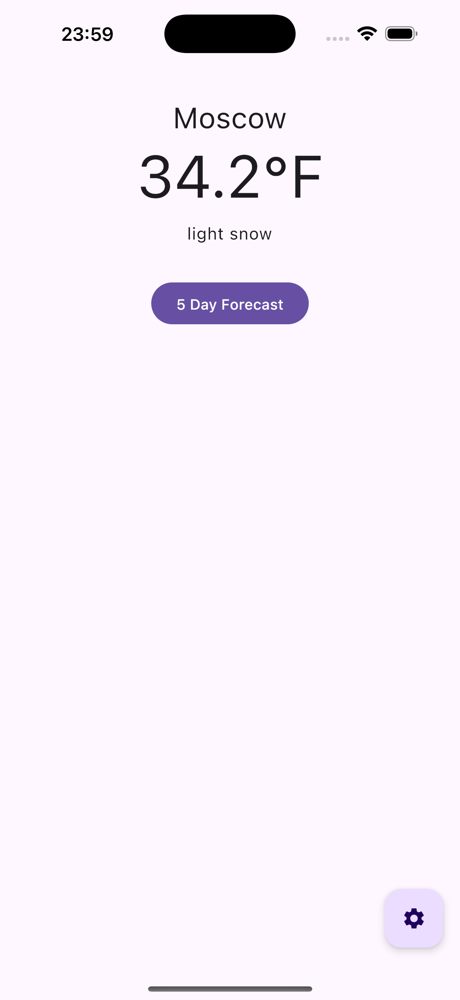
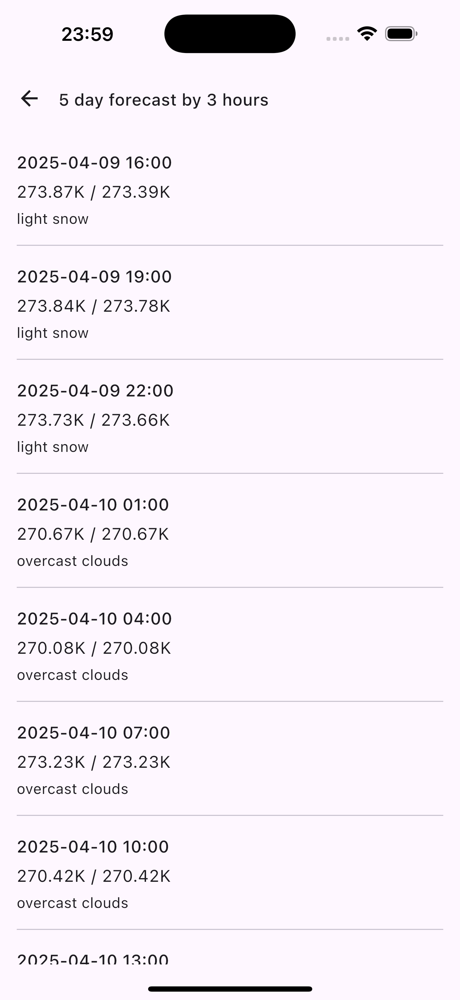
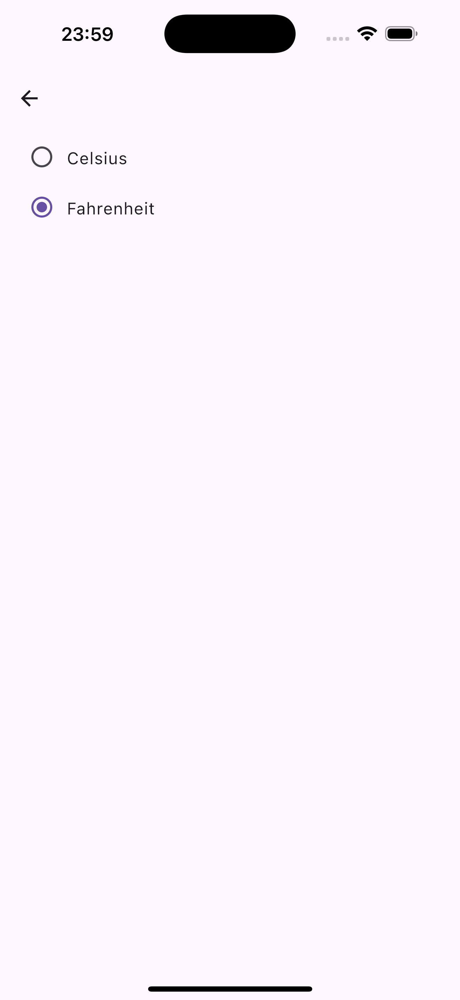
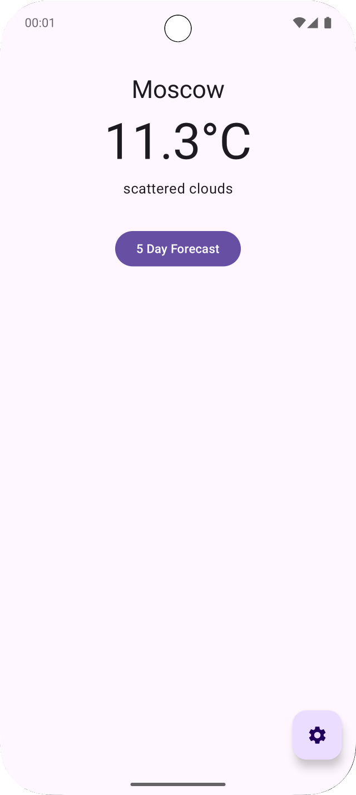
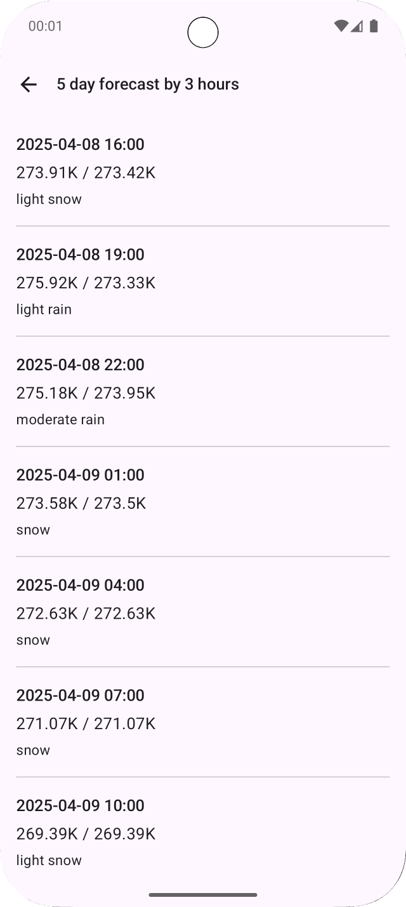
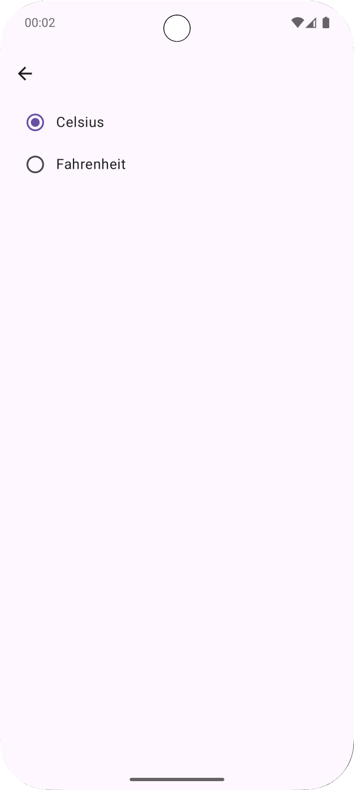

Стек:

1. Kotlin Multiplatform.
2. Compose Multiplatform.
3. PreCompose Navigation.
4. Jetpack ViewModel.
5. Room.
6. Ktor.

Экраны iOS:

|                       CurrentWeatherScreen                       |                         ForecastScreen                         |                       SettingsScreen                       |
|:----------------------------------------------------------------:|:--------------------------------------------------------------:|:----------------------------------------------------------:|
|  |  |  |

Экраны Android:

|                         CurrentWeatherScreen                         |                           ForecastScreen                           |                         SettingsScreen                         |
|:--------------------------------------------------------------------:|:------------------------------------------------------------------:|:--------------------------------------------------------------:|
|  |  |  |
