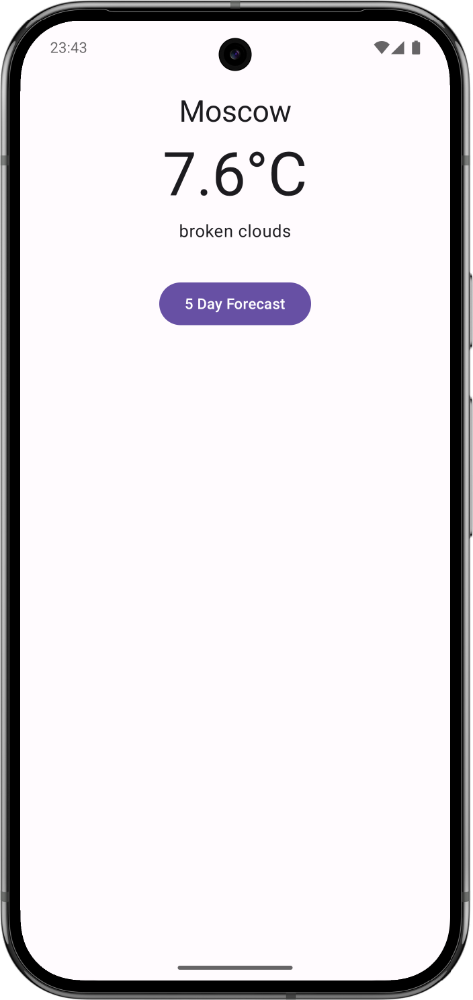
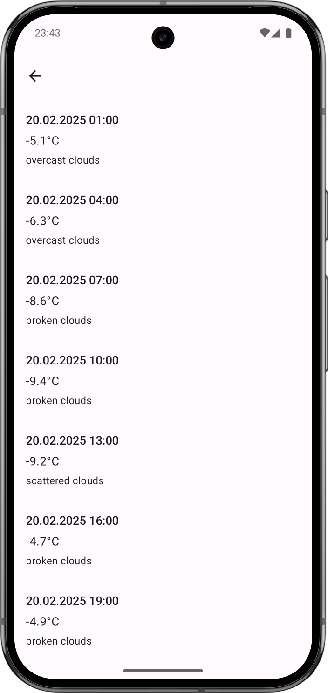

Стек:

1. Activity: MainActivity с Launch Mode singleTask.
2. Jetpack Compose.
3. Jetpack Navigation.
4. Jetpack ViewModel.
5. Retrofit + OkHttp: для получения данных о погоде из открытого API.

Обоснование выбора архитектуры:

Собрал я значит франкенштейна из MVVM & MVI, тем самым плюсы обоих подходов собрал, убрал лишний
бойлерплейт и получилавь своя архитектура, базирующаяся на следующих принципах:

1. Однонаправленный поток данных. Путём StateFlow и EventFlow, которые позволяют
   передавать данные между ViewModel и View.

abstract class StatefulViewModel<State : Any, Action, Event>(initialState: State) : ViewModel() {

    protected val mutableState = MutableStateFlow<State>(initialState)
    internal val state: StateFlow<State> = mutableState

    private val mutableEvent: Channel<Event> = Channel()
    internal val event: Flow<Event> get() = mutableEvent.receiveAsFlow()
    ...
}

2. Интенты. Пользовательские действия представлены как sealed Action
3. Редьюсер в виде handleAction функции, которая принимает пользовательское событие и
   преобразовывает его в состояние. При необходимости можно в отдельную сущность вынести, класс
   Reducer.

internal abstract fun handleAction(action: Action)

4. Иммутабельные состояния через sealed class.

Чем моё решение лучше MVI:

1. Меньше бойлерплейт кода. Полноценный MVI не разворачивал из-за обилия бойлерплейта, который был
   бы излишним в данном проекте. Из-за чего такая архитектура проще для погружения Android
   разработчиков, так как она похожа на MVVM, которая распостаняется Google в кодлабах и
   документации.
2. Моё решение проще интегрируется в рамки Android Architecture Components.
3. Меньше излищних абстракций. Считаю, что архитектура должна быть утилитарной. Моя архитектура
   просто масштабируется как для простых, так и для сложных экранов, не создавая громоздкой
   архитектуры для простых случаев.

Экраны:

|                     CurrentWeatherScreen                      |                       ForecastScreen                        |
|:-------------------------------------------------------------:|:-----------------------------------------------------------:|
|  |  |