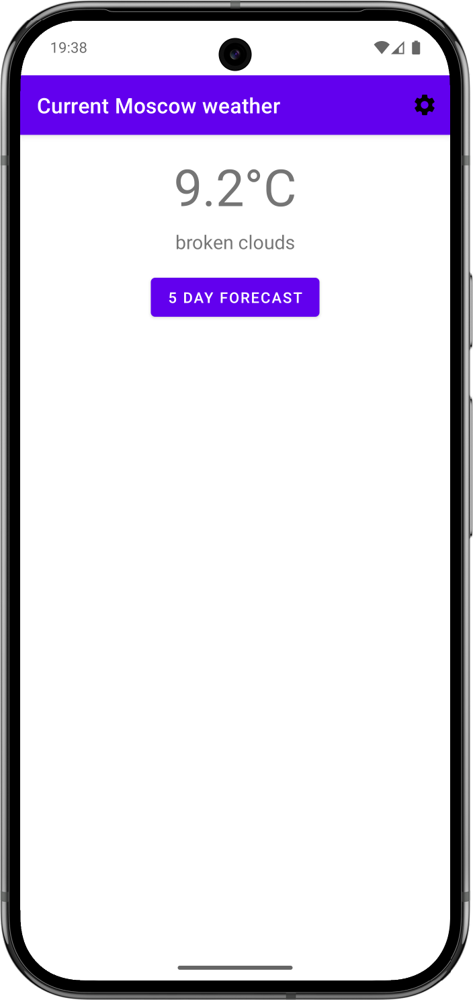
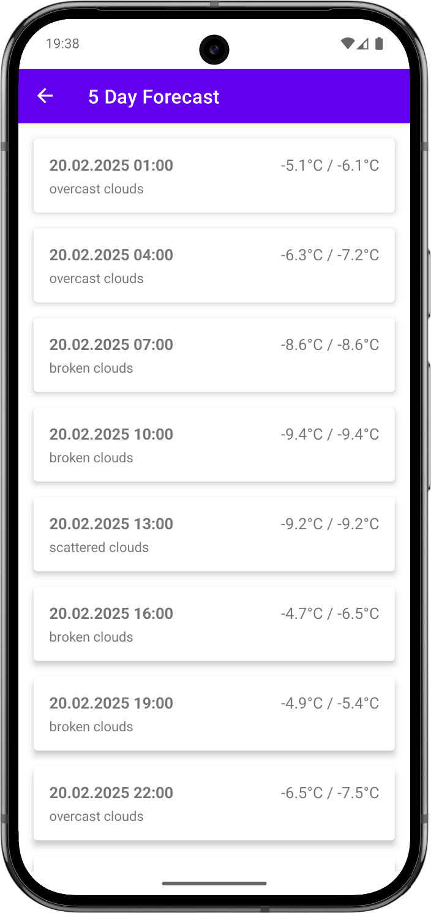
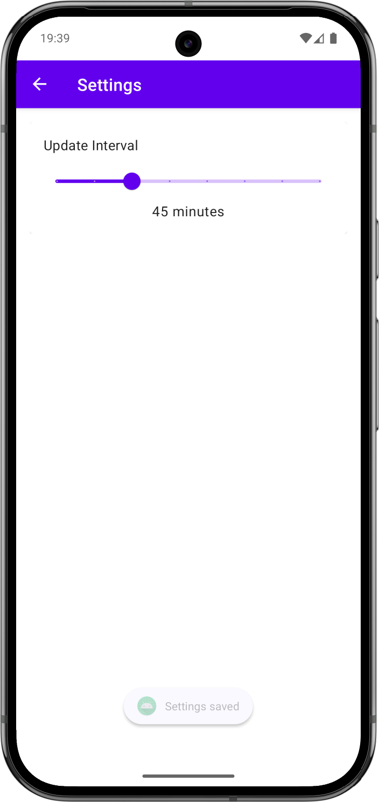

Стек:
1. Activity: MainActivity с Launch Mode singleTask
2. Fragments
3. XML layouts
4. Jetpack ViewModel
5. Retrofit + OkHttp: для получения данных о погоде из открытого API.
6. Room: для локального сохранения данных о погоде.
7. WorkManager: для фонового обновления данных о погоде.
8. Broadcast Receiver: для возобновления процесса обновления погоды фоне при появлении интернет-соединения.
9. ContentProvider: для предоставления данных о погоде другим приложениям.

Минусы текущего проекта:
0. Проект не многомодульный.
1. Сейчас проект нарезан вертикально, чтобы реализовать многомодульную архитектуру стоит резать горизонтально, т.е. на фичи, в каждой фиче будут свои слои: data, domain, presentation.
2. Тестов нет, хотябы Unit надо бы накинуть, но оставлю это на послед. проект или вовсе не буду этого делать, тесты не цель этого задания.
3. Можно было бы ещё подкинуть объекты для presentation слоя, но решил этого не делать, т.к. это практически полезно будет только в Compose проекте. Сделаю это позже.
4. Хардкод горорода Москва.

Экраны:
1. CurrentWeatherFragment
   

2. ForecastFragment
   

3. SettingsFragment
   